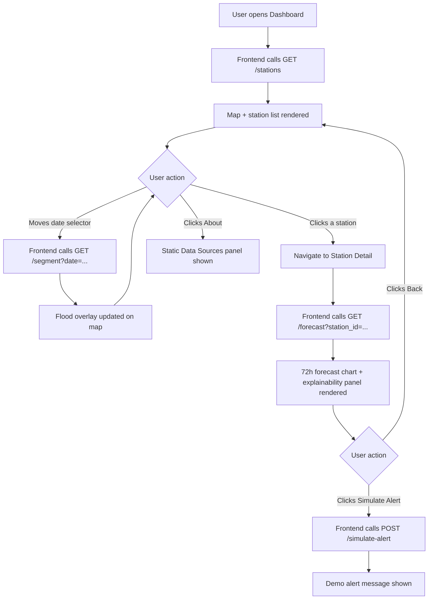
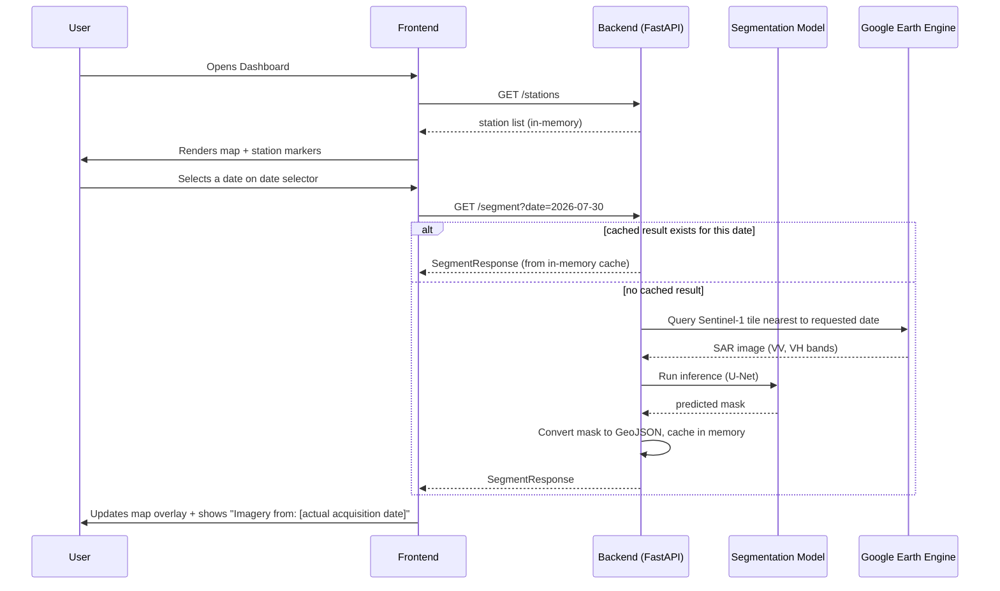
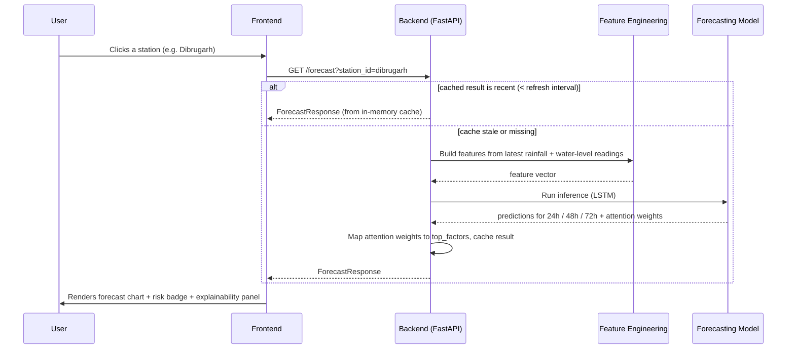
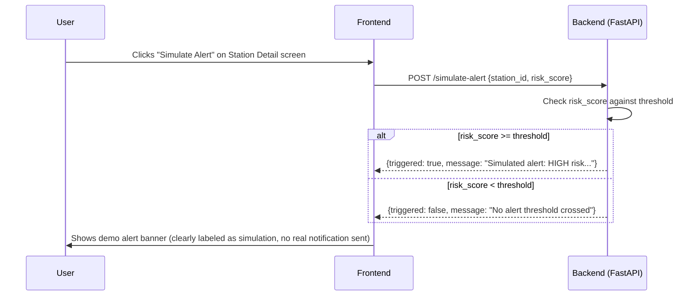
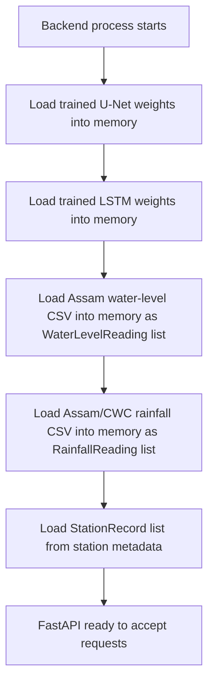

# App Flow Document

## AquaWatch — End-to-End User & System Flow

---

## 1. High-Level User Journey

---

## 2. Detailed Flow: Viewing Current Flood Extent

**Actors:** User, Frontend (React), Backend (FastAPI), Segmentation Model, Earth Engine

**Key behavior to note:** the "requested date" and "actual imagery acquisition date" can differ, because Sentinel-1 doesn't pass over every day. The response always includes both so the frontend can display the honest imagery age (per UI/UX Design Section 3).

---

## 3. Detailed Flow: Viewing a Station Forecast

---

## 4. Detailed Flow: Simulated Alert

---

## 5. System Startup Flow

**Important:** because there is no database, all of Steps B–F happen fresh every time the backend process starts. This keeps the system simple but means startup takes a few seconds longer than a database-backed system would (loading CSVs and model weights each time) — an acceptable tradeoff documented in the TRD.

---

## 6. Error / Edge Case Flows

| Scenario | Flow |
|---|---|
| No SAR tile available near requested date (cloud gap / no pass) | `/segment` returns the *nearest available* acquisition date with a flag `"note": "nearest available imagery, X days from requested date"` |
| Station has missing recent water-level readings | `/forecast` uses the last available reading, flags `"data_gap": true` in the response, frontend shows a "data gap" warning instead of hiding the issue |
| Earth Engine authentication expired/fails | Backend returns a 503 with `ErrorResponse {error: "gee_auth_failed", detail: "..."}`; frontend shows a friendly "map data temporarily unavailable" message |
| Backend restarted mid-session | All in-memory caches clear; frontend's next request simply triggers a fresh computation (slightly slower, but functionally correct — no crash) |

---
*Companion to AquaWatch_PRD_Assam.md, TRD.md, UI_UX_DESIGN.md, and BACKEND_SCHEMA.md.*
