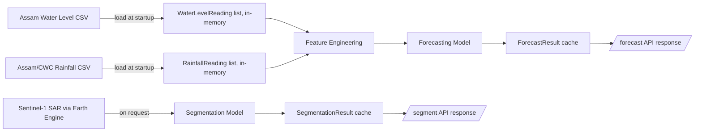

# Backend Schema Document

## AquaWatch — API & In-Memory Data Schema

> **Note:** This project has no database (see PRD Section 4, Non-Goals). This document therefore covers the **API request/response schemas** and **in-memory data structures** the backend uses, rather than a database table schema. If a persistent database is added in a future extension, this document should be revised to include table definitions.

---

## 1. In-Memory Data Objects

These are Python objects held in the FastAPI process's memory during runtime — not persisted to disk or a database.

### 1.1 `StationRecord`
Represents one water-level monitoring station.

```python
class StationRecord:
    station_id: str
    name: str
    river: str
    basin: str
    latitude: float
    longitude: float
    danger_level_m: float
```

### 1.2 `WaterLevelReading`
One timestamped water-level observation (loaded from the Assam Department CSV).

```python
class WaterLevelReading:
    station_id: str
    timestamp: datetime
    water_level_m: float
```

### 1.3 `RainfallReading`
One timestamped rainfall observation (loaded from CWC/IMD CSVs).

```python
class RainfallReading:
    region: str          # e.g. subdivision or station-linked region
    timestamp: datetime
    rainfall_mm: float
```

### 1.4 `SegmentationResult` (cached per date, in-memory dict keyed by date string)
```python
class SegmentationResult:
    date: str                  # ISO date of the source SAR image
    mask_geojson: dict         # flood polygon(s) as GeoJSON
    coverage_pct: float        # % of study area flagged as flooded
    model_version: str         # e.g. "unet_v1"
```

### 1.5 `ForecastResult` (cached per station, in-memory dict keyed by station_id)
```python
class ForecastResult:
    station_id: str
    generated_at: datetime
    forecasts: list[ForecastPoint]

class ForecastPoint:
    horizon_hours: int         # 24, 48, or 72
    predicted_level_m: float
    risk_score: float          # 0.0 - 1.0
    top_factors: list[str]     # e.g. ["rainfall_72h", "rate_of_rise"]
```

---

## 2. API Schemas (Pydantic models)

These define the exact request/response contracts for the FastAPI endpoints listed in the TRD.

### 2.1 `GET /stations`
**Response:**
```python
class StationListResponse(BaseModel):
    stations: list[StationSummary]

class StationSummary(BaseModel):
    station_id: str
    name: str
    river: str
    lat: float
    lon: float
    current_risk_level: str   # "LOW" | "MODERATE" | "HIGH"
```

### 2.2 `GET /segment?date={date}`
**Request params:** `date: str` (ISO 8601, e.g. `"2026-07-30"`)

**Response:**
```python
class SegmentResponse(BaseModel):
    date: str
    mask_geojson: dict
    coverage_pct: float
    imagery_acquisition_date: str   # actual satellite pass date, may differ from requested date
```

### 2.3 `GET /forecast?station_id={station_id}`
**Request params:** `station_id: str`

**Response:**
```python
class ForecastResponse(BaseModel):
    station_id: str
    station_name: str
    current_level_m: float
    danger_level_m: float
    forecasts: list[ForecastPointResponse]

class ForecastPointResponse(BaseModel):
    horizon_hours: int
    predicted_level_m: float
    risk_score: float
    risk_label: str            # "LOW" | "MODERATE" | "HIGH"
    top_factors: list[str]
```

### 2.4 `POST /simulate-alert`
**Request body:**
```python
class SimulateAlertRequest(BaseModel):
    station_id: str
    risk_score: float
```

**Response:**
```python
class SimulateAlertResponse(BaseModel):
    triggered: bool
    message: str                # e.g. "Simulated alert: HIGH risk at Dibrugarh (demo only, no real notification sent)"
```

### 2.5 `GET /health`
**Response:**
```python
class HealthResponse(BaseModel):
    status: str   # "ok"
```

### 2.6 Error Response (standard shape for all endpoints)
```python
class ErrorResponse(BaseModel):
    error: str
    detail: str
```

---

## 3. Data Flow Between Objects



---

## 4. Why No Database Table Schema

Per the PRD's simplified scope, all data is either:
- **Source data**, read fresh from the real CSV/XLSX files and satellite imagery on each session start, or
- **Derived results**, computed on-demand and cached only in memory for the duration of the running process.

This means there is no CREATE TABLE schema to define. If the project is later extended toward a real deployment (see PRD Section 16, Future Scope), the natural next step would be to persist `StationRecord`, `WaterLevelReading`, `RainfallReading`, `SegmentationResult`, and `ForecastResult` as actual database tables — the class definitions above are already structured to map directly onto future table columns if that extension happens.

---
*Companion to AquaWatch_PRD_Assam.md, TRD.md, UI_UX_DESIGN.md, and APP_FLOW.md.*
