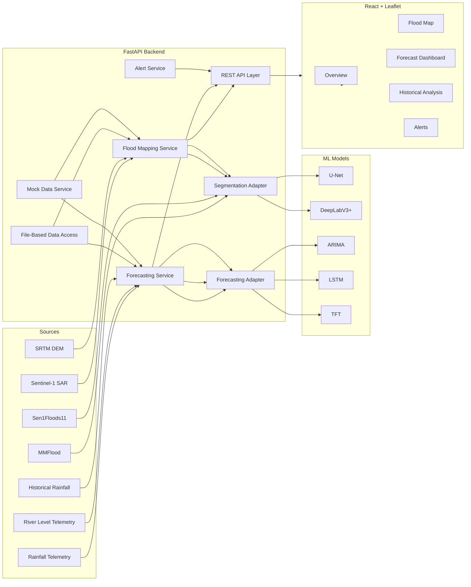

# AquaWatch — Flood Extent Mapping & Short-Term Flood Risk Forecasting

> **⏰ DEADLINE OVERRIDE (2026-09-22): 1-WEEK DEMO.** The original 5-month / 14-phase plan in this document is **suspended**. Only Section 16.1 (1-week demo phases) and the demo Definition of Done (Section 21) are active. Member 3 (Full-Stack) owns all five days. Member 1 and Member 2 are deferred to a later phase and must not block delivery. Build against mock data per `BACKEND_SCHEMA.md` so real models can be swapped in later without frontend changes.

## 1. Project Overview

### Objective
Build a practical, local-run B.Tech system for Assam, India that:
- maps flood extent from Sentinel-1 SAR imagery
- forecasts short-term flood risk from rainfall and river-level data
- exposes both capabilities through a FastAPI backend and a React + Leaflet frontend

### Problem Statement
The Brahmaputra basin experiences rapid flood formation, difficult terrain, telemetry gaps, and limited early warning visibility. AquaWatch addresses this by combining:
- near-real-time flood extent mapping from SAR imagery
- 24h / 48h / 72h risk forecasting from rainfall and river stages
- simple API-driven integration for a usable dashboard

### Assam / Brahmaputra Scope
- Region: Assam and Brahmaputra basin context
- Inputs: Sentinel-1, Assam/CWC river-level telemetry, Assam rainfall telemetry, IMD historical rainfall, MMFlood, Sen1Floods11, SRTM DEM
- Validation: optional Bhuvan references
- Execution: local development only, no hosted deployment layer

### Major Features
- Flood segmentation from Sentinel-1
- Flood extent overlay on Leaflet map
- Short-term rainfall/river-level forecasting
- Risk classification and simulated alerts
- Mock-data mode so development is not blocked while real data is collected

### Project Boundaries
In scope:
- FastAPI backend
- React + Leaflet frontend
- file-based data storage
- mock data and mock ML adapters
- later integration of separate ML models

Out of scope:
- database
- Docker/containerization
- cloud deployment/hosting
- microservices
- persistent database storage

### Expected Outcome (1-Week Demo)
A working local demo that can:
- show the flood map and forecast dashboard using mock data
- serve all 5 demo endpoints (`/health`, `/stations`, `/segment`, `/forecast`, `/simulate-alert`) with schema-compliant responses
- switch between mock and real data sources later without changing the API contract or frontend consumers
- integrate segmentation and forecasting models later with minimal refactoring (mock response shapes are the stable contract)

### Original Expected Outcome (5-month plan, suspended)

## 2. Existing Workspace Assessment

### Inspection Result
The workspace is currently empty at the project root. No source files, configs, scripts, tests, models, or data artifacts were found.

### Existing
- None

### What Is Working
- Nothing project-specific exists yet
- No code to preserve or adapt

### Incomplete
- Entire application stack
- all data paths
- all APIs
- all frontend views
- all ML integration points
- all tests

### To Create
- backend application structure
- frontend application structure
- file-based data directories
- mock datasets and seed generators
- model adapter layer
- API schemas and routes
- map/dashboard UI
- tests
- documentation

### To Modify
- None now, because no files exist yet

### Optional
- Bhuvan validation adapter
- explainability pages/outputs
- comparison views for U-Net vs DeepLabV3+ and LSTM vs TFT

### Architectural Observations
- Because the workspace is empty, the best design is a simple monorepo-style layout with clear separation between backend, frontend, data, models, scripts, and tests.
- File-based storage is the right fit for a student project with no database.
- Mock data must be first-class, not an afterthought, because real telemetry and flood-event labels are still being collected.

## 3. Complete Project Folder & File Plan

> This is the target structure for later implementation. It is not created now.

```text
AquaWatch Flood/
├─ implementation-plan.md
├─ backend/
│  ├─ app/
│  │  ├─ main.py
│  │  ├─ core/
│  │  │  ├─ config.py
│  │  │  ├─ cors.py
│  │  │  └─ logging.py
│  │  ├─ api/
│  │  │  ├─ router.py
│  │  │  └─ routes/
│  │  │     ├─ health.py
│  │  │     ├─ overview.py
│  │  │     ├─ flood_mapping.py
│  │  │     ├─ forecasting.py
│  │  │     ├─ alerts.py
│  │  │     └─ historical.py
│  │  ├─ schemas/
│  │  │  ├─ overview.py
│  │  │  ├─ flood_mapping.py
│  │  │  ├─ forecasting.py
│  │  │  ├─ alerts.py
│  │  │  └─ common.py
│  │  ├─ services/
│  │  │  ├─ data_service.py
│  │  │  ├─ mock_data_service.py
│  │  │  ├─ flood_mapping_service.py
│  │  │  ├─ forecasting_service.py
│  │  │  ├─ alert_service.py
│  │  │  └─ validation_service.py
│  │  ├─ ml/
│  │  │  ├─ segmentation_adapter.py
│  │  │  ├─ forecasting_adapter.py
│  │  │  └─ explainability.py
│  │  ├─ data_access/
│  │  │  ├─ filesystem_store.py
│  │  │  ├─ json_loader.py
│  │  │  └─ csv_loader.py
│  │  └─ utils/
│  │     ├─ dates.py
│  │     ├─ geo.py
│  │     └─ normalization.py
│  ├─ tests/
│  │  ├─ test_health.py
│  │  ├─ test_overview_api.py
│  │  ├─ test_flood_mapping_api.py
│  │  ├─ test_forecasting_api.py
│  │  ├─ test_alerts_api.py
│  │  └─ test_data_loading.py
│  └─ requirements.txt
├─ frontend/
│  ├─ src/
│  │  ├─ main.tsx
│  │  ├─ App.tsx
│  │  ├─ api/
│  │  │  ├─ client.ts
│  │  │  ├─ overview.ts
│  │  │  ├─ floodMapping.ts
│  │  │  ├─ forecasting.ts
│  │  │  └─ alerts.ts
│  │  ├─ components/
│  │  │  ├─ layout/
│  │  │  ├─ maps/
│  │  │  ├─ charts/
│  │  │  ├─ alerts/
│  │  │  └─ common/
│  │  ├─ pages/
│  │  │  ├─ OverviewPage.tsx
│  │  │  ├─ FloodMapPage.tsx
│  │  │  ├─ ForecastPage.tsx
│  │  │  └─ HistoricalPage.tsx
│  │  ├─ hooks/
│  │  ├─ types/
│  │  ├─ utils/
│  │  └─ styles/
│  ├─ public/
│  ├─ tests/
│  ├─ package.json
│  └─ vite.config.ts
├─ data/
│  ├─ raw/
│  │  ├─ rainfall/
│  │  ├─ river_levels/
│  │  ├─ satellite/
│  │  └─ flood_events/
│  ├─ processed/
│  │  ├─ rainfall/
│  │  ├─ river_levels/
│  │  ├─ satellite/
│  │  └─ features/
│  ├─ mock/
│  │  ├─ rainfall/
│  │  ├─ river_levels/
│  │  ├─ satellite/
│  │  ├─ flood_masks/
│  │  ├─ forecasts/
│  │  └─ alerts/
│  └─ outputs/
│     ├─ flood_masks/
│     ├─ flood_extent/
│     ├─ forecasts/
│     ├─ risk/
│     └─ alerts/
├─ models/
│  ├─ segmentation/
│  ├─ forecasting/
│  └─ manifests/
├─ scripts/
│  ├─ generate_mock_data.py
│  ├─ validate_data_files.py
│  ├─ prepare_segmentation_inputs.py
│  ├─ prepare_forecasting_inputs.py
│  └─ export_summary_reports.py
├─ docs/
│  ├─ api-contracts.md
│  ├─ data-dictionary.md
│  ├─ evaluation-plan.md
│  └─ demo-checklist.md
└─ tests/
   ├─ backend/
   └─ frontend/
```

### File / Directory Responsibilities

#### `backend/app/main.py`
- Purpose: FastAPI app entrypoint
- Responsibility: register routers, middleware, startup checks
- Depends on: `core/config.py`, `api/router.py`
- AquaWatch component: backend integration
- Phase: 2

#### `backend/app/core/*`
- Purpose: configuration, CORS, logging
- Responsibility: central app settings and environment access
- Depends on: `.env`, frontend origin config
- Component: backend foundation
- Phase: 2

#### `backend/app/api/routes/*`
- Purpose: REST endpoints
- Responsibility: serve overview, flood mapping, forecasting, alerts, history
- Depends on: services and schemas
- Component: all UI-facing backend functionality
- Phase: 2-8

#### `backend/app/services/*`
- Purpose: business logic
- Responsibility: combine file-based data, mock data, model adapters, and output shaping
- Depends on: data access, ml adapters
- Component: backend core
- Phase: 3-7

#### `backend/app/ml/*`
- Purpose: ML integration boundary
- Responsibility: adapter interfaces for segmentation and forecasting
- Depends on: future model artifacts in `models/`
- Component: ML integration
- Phase: 4-6

#### `backend/app/data_access/*`
- Purpose: file-based read/write helpers
- Responsibility: load JSON/CSV, validate paths, normalize records
- Depends on: data directory layout
- Component: file-based data layer
- Phase: 3

#### `backend/tests/*`
- Purpose: backend verification
- Responsibility: API and service tests
- Depends on: pytest-style tooling later
- Component: testing
- Phase: 12

#### `frontend/src/*`
- Purpose: UI application
- Responsibility: dashboard, map, charts, alerts
- Depends on: backend API contract
- Component: React + Leaflet frontend
- Phase: 8-10

#### `data/raw/*`
- Purpose: original collected source files
- Responsibility: preserve source telemetry and imagery metadata
- Depends on: field collection / downloads
- Component: data ingestion
- Phase: 1-3

#### `data/processed/*`
- Purpose: standardized datasets
- Responsibility: cleaned rainfall/river-level/satellite features
- Depends on: raw data and preprocessing scripts
- Component: preprocessing
- Phase: 3-6

#### `data/mock/*`
- Purpose: development fallback data
- Responsibility: keep app usable before real data is ready
- Depends on: planned seed generator
- Component: mock strategy
- Phase: 4

#### `data/outputs/*`
- Purpose: generated app outputs
- Responsibility: flood masks, extents, forecasts, risk, alerts
- Depends on: ML adapters and services
- Component: runtime outputs
- Phase: 5-8

#### `models/*`
- Purpose: model artifacts and manifests
- Responsibility: store versions, paths, and metadata for U-Net, DeepLabV3+, ARIMA, LSTM, TFT
- Depends on: training work done separately
- Component: ML models
- Phase: 5-6

#### `scripts/*`
- Purpose: utility scripts
- Responsibility: mock generation, validation, preprocessing, reporting
- Depends on: file layout
- Component: automation without over-engineering
- Phase: 4, 12, 13

## 4. System Architecture

### Flood Mapping Pipeline
Sentinel-1 (Google Earth Engine)  
→ SAR preprocessing  
→ flood segmentation / thresholding  
→ flood mask  
→ flood extent calculation  
→ FastAPI response  
→ React + Leaflet map

### Forecasting Pipeline
Rainfall + river levels  
→ cleaning / feature engineering  
→ ARIMA / LSTM / TFT forecasting  
→ 24h / 48h / 72h prediction  
→ risk classification  
→ FastAPI response  
→ React dashboard

### Mermaid Architecture Diagram



## 5. Technology Stack

### Backend
- Python
- FastAPI
- Pydantic
- Uvicorn

### Frontend
- React
- Leaflet
- TypeScript
- Vite

### ML / Data Processing
- NumPy
- Pandas
- scikit-learn
- statsmodels for ARIMA
- TensorFlow or PyTorch later, depending on the selected model implementation

### Geospatial Processing
- GeoJSON
- raster-to-vector / mask processing utilities
- optional Earth Engine integration for Sentinel-1 acquisition

### Visualization
- Leaflet maps
- chart library already implied by React dashboard need
- simple status cards and tables

### Testing
- backend API tests
- service tests
- frontend integration/component tests
- mock-data validation tests

## 6. Environment Configuration

### Required Environment Variables
- `APP_ENV`
- `BACKEND_HOST`
- `BACKEND_PORT`
- `CORS_ORIGINS`
- `API_BASE_URL`
- `DATA_DIR`
- `RAW_DATA_DIR`
- `PROCESSED_DATA_DIR`
- `MOCK_DATA_DIR`
- `OUTPUT_DATA_DIR`
- `MODEL_DIR`
- `EARTH_ENGINE_PROJECT`
- `EARTH_ENGINE_CREDENTIALS`
- `USE_MOCK_DATA`
- `USE_MOCK_MODELS`
- `DEFAULT_REGION`
- `DEFAULT_TIMEZONE`

### `.env.example`
Should include all the above variables with safe placeholder values.

### Backend Configuration
- FastAPI reads environment variables from a single config module
- mock/real switching controlled by flags, not code edits
- file paths resolved relative to `DATA_DIR` and `MODEL_DIR`

### Frontend API Configuration
- a single base URL variable for the backend
- no hardcoded endpoints inside components

### CORS
- allow local frontend development origin
- keep origin list explicit
- do not allow all origins by default

### Data Paths
- all file paths should be configured, not hardcoded
- use separate folders for raw, processed, mock, and output data

### Model Paths
- separate segmentation and forecasting model directories
- include manifest files describing version, input schema, output schema, and status

### Earth Engine
- if Sentinel-1 is pulled from Google Earth Engine, configuration must be isolated in one adapter so the rest of the app does not depend directly on Earth Engine APIs

## 7. File-Based Data Architecture

Because there is no database, all data must be file-backed.

### Proposed Organization
- rainfall data: CSV/JSON time series
- river-level data: CSV/JSON time series
- flood events: JSON/CSV event logs
- satellite metadata: JSON records
- flood masks: GeoJSON/NPZ/PNG references, depending on the chosen representation
- segmentation results: JSON summaries plus mask artifacts
- forecast results: JSON time-series outputs
- risk/alerts: JSON event records

### Representative Schemas

#### Rainfall CSV
```csv
date,station_id,station_name,district,rainfall_mm,source,quality_flag
2026-07-01,ASM001,Guwahati,Kamrup,42.5,IMD,ok
```

#### River Levels CSV
```csv
datetime,gauge_id,gauge_name,river_name,water_level_m,warning_level_m,danger_level_m,source,quality_flag
2026-07-01T06:00:00+05:30,G001,Tezpur,Brahmaputra,45.2,43.5,46.8,CWC,ok
```

#### Flood Event JSON
```json
{
  "event_id": "flood-2026-07-assam-001",
  "date": "2026-07-01",
  "districts": ["Kamrup", "Darrang"],
  "severity": "high",
  "source": "curated",
  "notes": "Representative flood episode for evaluation"
}
```

#### Satellite Metadata JSON
```json
{
  "scene_id": "S1A_20260701_001",
  "sensor": "Sentinel-1",
  "acquisition_date": "2026-07-01",
  "region": "Assam",
  "orbit": "descending",
  "polarization": "VV/VH",
  "source": "Google Earth Engine"
}
```

#### Segmentation Result JSON
```json
{
  "scene_id": "S1A_20260701_001",
  "model": "unet",
  "flood_pixel_count": 12345,
  "flood_area_sq_km": 87.6,
  "confidence": 0.92,
  "mask_path": "data/outputs/flood_masks/S1A_20260701_001.geojson"
}
```

#### Forecast Result JSON
```json
{
  "location_id": "G001",
  "generated_at": "2026-07-01T06:00:00+05:30",
  "horizons": {
    "24h": {"value": 46.1, "risk": "medium"},
    "48h": {"value": 46.8, "risk": "high"},
    "72h": {"value": 47.0, "risk": "high"}
  }
}
```

#### Alert JSON
```json
{
  "alert_id": "alert-001",
  "level": "high",
  "message": "River level expected to exceed danger threshold in 48h",
  "generated_at": "2026-07-01T06:00:00+05:30"
}
```

## 8. Mock Data Strategy

### Mock Data Targets
- rainfall
- river levels
- flood events
- satellite metadata
- flood segmentation outputs
- flood masks
- forecasts
- risk levels
- simulated alerts

### Strategy
- create mock datasets that follow the final API schemas exactly
- keep mock and real datasets interchangeable at the service layer
- identify mock records using a source flag such as `mock`
- make the UI consume API responses, not raw files

### Replacement Rule
Mock data will later be replaced by real data without changing:
- endpoint paths
- response shape
- frontend consumers

Only the internal data source changes.

### Planned Mock / Seed Generation Scripts
- `scripts/generate_mock_data.py`
- `scripts/validate_data_files.py`

These should generate:
- station-level rainfall series
- gauge-level river-level series
- representative flood events
- sample Sentinel-1 scene metadata
- synthetic segmentation outputs and masks
- synthetic forecast outputs
- alert examples

## 9. ML Integration Plan

### Segmentation
Input:
- Sentinel-1 scene metadata
- preprocessed SAR image or derived features

Process:
- adapter receives scene and preprocessing outputs
- model returns flood mask / probabilities
- service converts mask to flood extent metadata

Output:
- flood mask artifact
- extent summary
- confidence / explainability fields where available

### Forecasting
Input:
- rainfall history
- river-level history
- derived features

Process:
- adapter runs ARIMA, LSTM, or TFT depending on mode
- outputs 24h / 48h / 72h forecasts
- service classifies risk level

Output:
- prediction values
- risk band
- supporting feature metadata

### Interfaces
#### Segmentation Adapter
- `predict(scene_input) -> segmentation_result`

#### Forecasting Adapter
- `predict(time_series_input) -> forecast_result`

### Services
- `flood_mapping_service.py` orchestrates preprocessing → model → postprocessing
- `forecasting_service.py` orchestrates feature engineering → model → risk classification
- `mock_data_service.py` provides safe fallback results

### Mock Model Behavior
- deterministic sample outputs
- schema-compliant results
- stable enough for frontend development and test fixtures

### Real Model Integration Later
- plug model artifacts into the adapter layer
- keep request/response contracts unchanged
- separate explainability from prediction execution

## 10. Backend Architecture

### API Layer
- thin route handlers
- input validation
- response serialization

### Schemas
- request/response contracts for overview, mapping, forecasting, alerts, history
- strict schema validation to prevent malformed outputs reaching the frontend

### Services
- business logic lives here
- no route should directly read raw files or call model code

### Data Access
- file-based loaders for JSON and CSV
- path normalization and existence checks

### ML Integration
- adapters isolate model loading and prediction
- easy replacement of mock vs real models

### Configuration
- one config source for environment and file paths

### Utilities
- date parsing
- geospatial helpers
- naming normalization

### Error Handling
- explicit validation errors for missing files and invalid schemas
- clear error responses for telemetry gaps and missing model artifacts
- no silent fallback from invalid inputs

## 11. API Blueprint

> All endpoints are REST JSON endpoints unless noted otherwise.

### `GET /health`
- Purpose: service check
- Request: none
- Response: app status, data mode, version
- Status codes: `200`
- Errors: none expected

```json
{ "status": "ok", "mode": "mock", "service": "AquaWatch API" }
```

### `GET /overview`
- Purpose: single-page dashboard summary
- Request: optional `region`, `date`
- Response: current flood status, risk, rainfall, river level, alerts
- Validation: date format if provided
- Status codes: `200`, `400`, `503`
- Source: mock or real overview aggregation

### `GET /flood/mapping/latest`
- Purpose: latest flood map package
- Request: optional `scene_id`
- Response: flood extent, mask URL/path, confidence, metadata
- Status codes: `200`, `404`, `503`
- Errors: missing scene, missing model output

### `GET /flood/mapping/scenes`
- Purpose: list available Sentinel-1 scenes
- Request: optional filters by date/region
- Response: scene metadata list
- Status codes: `200`

### `POST /flood/mapping/predict`
- Purpose: run segmentation pipeline for a scene
- Request: scene metadata or scene reference
- Response: mask summary, flood extent, explainability metadata
- Status codes: `200`, `400`, `404`, `422`, `500`
- Source: mock model or real model

### `GET /forecast/latest`
- Purpose: latest forecast package
- Request: optional `location_id`
- Response: 24h/48h/72h predictions and risk
- Status codes: `200`, `404`, `503`

### `POST /forecast/predict`
- Purpose: run forecasting pipeline
- Request: rainfall + river-level feature payload or location reference
- Response: horizon predictions, risk classification
- Status codes: `200`, `400`, `422`, `500`

### `GET /forecast/history`
- Purpose: historical forecast runs
- Request: optional location/date range
- Response: prior forecast outputs

### `GET /alerts`
- Purpose: list active and recent alerts
- Request: optional severity/date filters
- Response: alert list with status and timestamps

### `GET /historical/rainfall`
- Purpose: rainfall history
- Request: station/date filters
- Response: time-series records

### `GET /historical/river-levels`
- Purpose: river-level history
- Request: gauge/date filters
- Response: time-series records

### `GET /historical/flood-events`
- Purpose: flood event archive
- Request: date/district filters
- Response: event records

### `GET /historical/comparison`
- Purpose: compare rainfall, river levels, and flood extent over time
- Response: aligned analytics payload

### Representative Error Response
```json
{
  "detail": "Forecast data unavailable for the requested station",
  "code": "DATA_NOT_FOUND"
}
```

## 12. Frontend Integration Plan

### Communication Pattern
- React calls FastAPI through a single API client
- all pages consume typed API wrappers
- no direct file access from frontend

### API Base URL
- environment-based backend URL
- local development friendly

### CORS
- backend must allow the frontend origin used during local development

### Map Data
- Leaflet consumes GeoJSON / map-ready response payloads
- flood masks and extents rendered as overlays

### Visual Components
- flood extent layers
- rainfall charts
- river-level charts
- forecast cards
- risk badges
- alert lists

### UI States
- loading
- empty
- error
- partial data

### Frontend Modules
- `api/client.ts` for request setup
- `api/*.ts` for endpoint wrappers
- `components/maps/*` for Leaflet rendering
- `components/charts/*` for trend visuals
- `pages/*` for screens

## 13. Dashboard Requirements

### Overview
Backend must provide:
- current flood status
- overall risk
- rainfall summary
- river-level summary
- active alerts

### Flood Map
Backend must provide:
- flood extent
- flood masks
- affected areas
- river/gauge locations
- satellite metadata

### Forecast
Backend must provide:
- 24h forecast
- 48h forecast
- 72h forecast
- risk level
- trend charts

### Historical Analysis
Backend must provide:
- rainfall history
- river-level history
- flood event archive
- flood extent comparison snapshots

## 14. Error Handling & Validation

### Missing Data
- return explicit `404` or domain-specific `DATA_NOT_FOUND`

### Malformed Files
- validate schema before use
- return clear file parsing errors

### Telemetry Gaps
- mark gaps in metadata
- do not fabricate values inside real-data mode

### Missing Models
- surface unavailable model artifacts with `503` or `MODEL_NOT_AVAILABLE`

### Invalid Model Output
- validate output schema and numeric ranges before returning

### Invalid API Requests
- use request schema validation and `422`

### Prediction Failures
- propagate model errors as controlled API errors

### Unavailable Satellite Data
- return a clear acquisition/status error and preserve the request context

## 15. Testing Strategy

### Backend APIs
- health check
- overview
- flood mapping
- forecasting
- alerts
- historical data

### Data Loading
- CSV/JSON loaders
- missing file handling
- malformed schema rejection

### Mock Data
- mock generator output validity
- deterministic result shapes

### ML Adapters
- segmentation adapter contract
- forecasting adapter contract

### Segmentation Integration
- mask generation path
- flood extent summarization

### Forecasting Integration
- horizon generation
- risk classification

### Invalid / Missing Data
- station missing
- gauge missing
- scene missing
- model artifact missing

### Frontend / API Integration
- endpoint contract compatibility
- CORS behavior
- loading and error states

### Maps / Charts / Alerts
- map payload rendering
- chart payload rendering
- alert display logic

## 16. Implementation Phases — 1-Week Demo Timeline

> **Timeline override (2026-09-22):** The original 5-month / 14-phase plan below is **suspended**. This project must ship as a demo within **1 week**. Only the phases listed in Section 16.1 are in scope. All other phases (3, 5, 6, 11, 13, and the full testing/documentation suites) are **out of scope** for the demo and must not block delivery. Real-model integration (Member 1 / Member 2) happens later against the mock contracts built here — the mock response shapes must be preserved exactly so real data can be swapped in without frontend changes.

### 16.1 In-Scope Demo Phases (1 week)

#### Day 1 — Backend Foundation
- Objective: runnable FastAPI shell with health check
- Tasks: app entrypoint, router registration, CORS, logging, `GET /health`
- Files: `backend/app/main.py`, `backend/app/core/config.py`, `backend/app/core/cors.py`, `backend/app/api/router.py`, `backend/app/api/routes/health.py`
- Dependencies: Python env with FastAPI + uvicorn installed
- Expected Output: `uvicorn` starts, `GET /health` returns `{"status": "ok"}`
- Definition of Done: backend process runs and responds to health check

#### Day 2 — Mock Data + Core Endpoints
- Objective: schema-compliant mock responses for all demo endpoints
- Tasks: in-memory mock data (stations, rainfall, water levels), `/stations`, `/segment?date=` (mock GeoJSON flood mask), `/forecast?station_id=` (mock 24/48/72h), `/simulate-alert`
- Files: `backend/app/api/routes/stations.py`, `segment.py`, `forecast.py`, `alerts.py`; `backend/app/services/mock_data_service.py`; `data/mock/*` seed files
- Dependencies: schemas from `BACKEND_SCHEMA.md`
- Expected Output: all 5 endpoints return valid mock responses
- Definition of Done: every endpoint in the TRD API contract returns a correct mock payload

#### Day 3 — Frontend Shell + Dashboard View
- Objective: React + Leaflet consuming the backend
- Tasks: Vite + React + Leaflet + Recharts setup, API client, typed wrappers, `Dashboard` view (map + station list + risk badges + date selector + imagery-age disclosure)
- Files: `frontend/src/main.tsx`, `App.tsx`, `api/client.ts`, `api/*.ts`, `pages/DashboardPage.tsx`, `components/maps/*`, `components/layout/*`
- Dependencies: Day 2 endpoints
- Expected Output: map renders with flood overlay and station markers
- Definition of Done: Dashboard view shows live/mock map + station list

#### Day 4 — Station Detail + About Views
- Objective: complete the remaining demo screens
- Tasks: `StationDetail` view (72h forecast chart, danger-level reference line, explainability panel, Simulate Alert button), `About` view (data sources + limitations)
- Files: `frontend/src/pages/StationDetailPage.tsx`, `AboutPage.tsx`, `components/charts/*`, `components/alerts/*`
- Dependencies: Day 2 endpoints
- Expected Output: all 3 UI/UX screens implemented
- Definition of Done: user can open Dashboard, click a station, see forecast, simulate an alert, and read About

#### Day 5 — Polish, Integration Smoke Tests, Handoff
- Objective: stabilize the demo and verify end-to-end
- Tasks: loading/error states, responsiveness, imagery-age disclosure text, run both servers, full manual walkthrough of every user journey, record any blockers
- Files: `backend/tests/smoke_test.py`, `docs/demo-checklist.md`
- Dependencies: Days 1-4
- Expected Output: demo-ready system, verified walkthrough
- Definition of Done: all user journeys in `UI_UX_DESIGN.md` Section 7 work locally; demo checklist complete

### 16.2 Out of Scope for the 1-Week Demo (do NOT attempt)
- Phases 3 (file-based data layer), 5 (flood mapping integration), 6 (forecasting integration), 11 (full system integration beyond navigation)
- Real Sentinel-1 / Earth Engine ingestion (Member 1)
- Real LSTM / ARIMA / TFT models (Member 2)
- Phase 12 full test suite, Phase 13 real-data migration, Phase 14 full documentation
- Docker, database, cloud deployment

### 16.3 Original 5-Month Plan (suspended, reference only)

## 17. Timeline — 1-Week Demo (override)

> **Timeline override (2026-09-22):** The original 5-month timeline below is **suspended**. The active schedule is a **1-week demo delivery** starting 2026-09-22, with phases defined in Section 16.1.

| Day | Focus | Owner |
|---|---|---|
| Day 1 | Backend foundation (`/health`) | Member 3 |
| Day 2 | Mock data + core endpoints (`/stations`, `/segment`, `/forecast`, `/simulate-alert`) | Member 3 |
| Day 3 | Frontend shell + Dashboard view | Member 3 |
| Day 4 | Station Detail + About views | Member 3 |
| Day 5 | Polish, smoke tests, walkthrough, handoff | Member 3 |

### Original 5-Month Timeline (suspended, reference only)

## 18. Real Data Migration

### Mock Data → Real Data

#### Rainfall
- Replace generated station series with IMD/CWC Assam records
- Keep CSV/JSON schema unchanged

#### River Levels
- Replace synthetic gauges with actual telemetry
- Preserve field names and API response shape

#### Satellite Imagery
- Replace sample scene metadata with real Sentinel-1 scenes from Earth Engine
- Maintain the same scene descriptor contract

#### Segmentation Outputs
- Replace mock masks with model-generated masks
- Keep mask path and summary fields stable

#### Forecasting Outputs
- Replace synthetic forecasts with real model predictions
- Keep horizon object structure unchanged

### What Changes
- data source
- preprocessing logic fidelity
- model outputs

### What Remains Unchanged
- API routes
- frontend consumers
- response schemas
- directory conventions

## 19. Team Responsibility Mapping — 1-Week Demo

> **Scope override (2026-09-22):** Responsibilities below are scoped to the **1-week demo** (Section 16.1). Real-model work (Member 1 / Member 2) is deferred to a later phase and must not block the demo; the mock contracts built by Member 3 are the interface that work will plug into later.

### Member 3 — Full-Stack (primary owner of the 1-week demo)
- Files: `backend/app/main.py`, `backend/app/api/routes/*`, `frontend/src/*`, `backend/app/services/mock_data_service.py`, `backend/app/services/alert_service.py`
- Days: 1-5 (all five days)
- Tasks: FastAPI backend + mock data + all 5 endpoints + full React/Leaflet UI (Dashboard, Station Detail, About) + smoke tests + demo walkthrough
- Definition of Done: all user journeys in `UI_UX_DESIGN.md` Section 7 work locally against mock data

### Member 1 — Remote Sensing / Computer Vision (deferred)
- Files: `backend/app/ml/segmentation_adapter.py`, `backend/app/services/flood_mapping_service.py`, `data/raw/satellite/*`, `data/outputs/flood_masks/*`
- Status: **Out of scope for the 1-week demo.** Later phase. Will replace mock `/segment` responses with real Sentinel-1 segmentation outputs using the same response contract (`BACKEND_SCHEMA.md` Section 2.2) — no frontend changes required.

### Member 2 — Time-Series / ML (deferred)
- Files: `backend/app/ml/forecasting_adapter.py`, `backend/app/services/forecasting_service.py`, `data/raw/rainfall/*`, `data/raw/river_levels/*`, `data/processed/features/*`
- Status: **Out of scope for the 1-week demo.** Later phase. Will replace mock `/forecast` responses with real ARIMA/LSTM/TFT predictions using the same response contract (`BACKEND_SCHEMA.md` Section 2.3) — no frontend changes required.

### Original Team Responsibility Mapping (5-month plan, suspended)

## 20. Risks & Mitigations

### Assam station coverage
- Risk: sparse or uneven telemetry
- Mitigation: station metadata, fallback aggregation, explicit missing-data handling

### Telemetry gaps
- Risk: broken time-series continuity
- Mitigation: gap flags, interpolation only where appropriate, no silent fill in real mode

### SAR preprocessing complexity
- Risk: heavy geospatial processing scope
- Mitigation: isolate preprocessing in one service and start with mock outputs

### Lack of Assam-specific training events
- Risk: limited labeled flood cases
- Mitigation: use MMFlood and Sen1Floods11 for training/comparison and Assam events for validation

### Model integration delays
- Risk: trained models arrive late
- Mitigation: mock adapters preserve contracts

### Dataset availability
- Risk: slow data collection
- Mitigation: file-based mock data and staged replacement

### Frontend/backend integration problems
- Risk: contract mismatch
- Mitigation: strict schemas, typed API wrappers, early end-to-end smoke tests

## 21. Final Definition of Done — 1-Week Demo

> **Scope override (2026-09-22):** This is the Definition of Done for the **1-week demo**. The original 5-month checklist below is suspended.

### Demo Definition of Done
- [ ] Backend starts and `GET /health` returns `{"status": "ok"}`
- [ ] All 5 demo endpoints return valid mock responses per `BACKEND_SCHEMA.md`:
      `/stations`, `/segment?date=`, `/forecast?station_id=`, `/simulate-alert`, `/health`
- [ ] Mock response shapes match `BACKEND_SCHEMA.md` exactly (so Member 1 / Member 2 can swap in real models later with no frontend changes)
- [ ] Frontend runs and renders the Dashboard view (map + flood overlay + station markers + risk badges + date selector + imagery-age disclosure)
- [ ] Station Detail view renders the 72h forecast chart with danger-level reference line, explainability panel, and Simulate Alert button
- [ ] About view lists data sources and limitations
- [ ] Navigation works between Dashboard, Station Detail, and About
- [ ] Loading and error states handled (no broken routes, no silent failures)
- [ ] Full manual walkthrough of every user journey in `UI_UX_DESIGN.md` Section 7 passes
- [ ] Both backend (`uvicorn`) and frontend (`npm run dev`) run locally without errors

### Original 5-Month Definition of Done (suspended)

